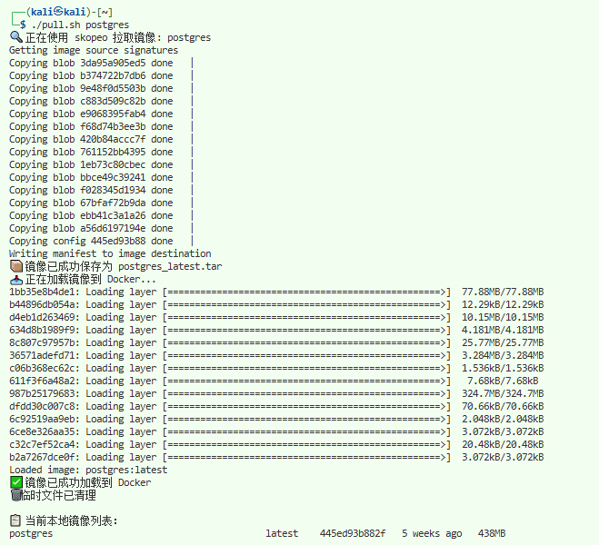

# skopeo-pull

使用skopeo代替docker pull，可以注入proxy环境变量而不用修改docker配置文件
注：脚本使用AI生成

## skopeo install

参考[Skopeo官方安装文档](https://github.com/containers/skopeo/blob/main/install.md)

```bash
apt install skopeo
```

## 使用方法

```bash
# source proxy.sh 或者其他方法配置proxy环境变量，然后使用脚本拉取镜像
./pull.sh postgres
```

## 示例


